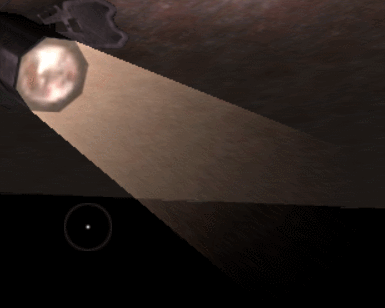
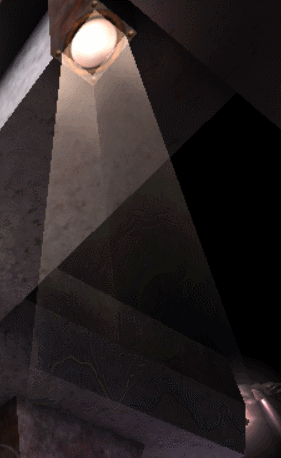
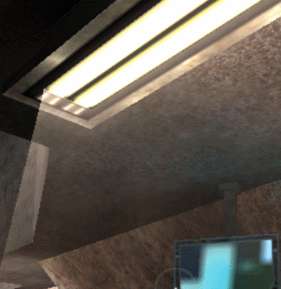
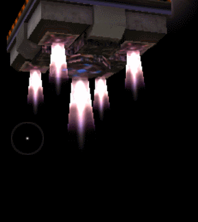

Unsorted
========

* [ ] zoom acceleration at high altitudes
* [ ] procedural clouds, skybox, sunset, MOON, etc https://github.com/shff/opengl_sky
* [ ] shaders with gradients
* [ ] construction lines
* [ ] add noise to terrain mipmap
* [ ] water reflecting sky
* [ ] redo terrain height tracking AGAIN ...
* [ ] explosions with pioneering black smoke trails

Fixes
=====

Logic adjustments or very small features.

* [x] Adjust trackHeight
* [x] Make zooming "softer"
* [x] Make rotation "softer"
* [x] Butter smooth zooming
* [x] Make a new pulsating effect
* [ ] Redo mouse / key camera scrolling with vectors
* [ ] mouse rotating inverts its origin when too close
* [ ] lock & hide mouse while rotating (waiting for rotation logic PR to get merged)
* [ ] add fade to title screen?
* [x] add fade to game start
* [x] remove blue box from logo
* [x] fix "landing" effect (prolly in setViewPos() - display3d.cpp)
* [ ] fix blinking of start pad X
* [ ] fix blinking of power resources
* [x] make startup images 1080p
* [ ] remove all "due to a bug in SDL's SDL_ShowCursor()" comments
* [x] randomize animation frame on eg. oil derricks
* [x] randomize rotation on radars
* [x] animation interpolation between frames
* [ ] split large functions into smaller functions
* [x] redo wzSetCursor() usage in renderLoop. add wzApplyCursor() in the end of the main loop and compare it with wz_old_cursor.
* [x] make possible to have totally top-down camera pitch
* [ ] small radars have "gaps" in the middle of the dish, cyborgs seem to have too
* [ ] oil derrick should stop at the current frame (not reset frames)
* [ ] camera position is not saved between games
* [ ] flying debris should spin, when flying and also change it's spinning when hitting the ground
* [ ] what's the meaning of the big X cursor that appears on the sides of the screen?

Features:
=========

New features requiring more testing and/or design decisions.

* [ ] projectiles refresh
* [ ] redo rain with OOT style rain. Add some rain drops on camera.
* [ ] rain looks wierd when rotating?
* [ ] rain stops abruptly
* [ ] fix "move unit here" click effect on cursor, replace with lake ripple + 3d version animated effect of cursor
* [x] highlight units by [stencil testing](https://learnopengl.com/Advanced-OpenGL/Stencil-testing)
* [ ] keep the radar static, redraw the positional square on the radar (to accurately convey the camera position)
* [ ] move tank with arrow keys / gamepad / first person view / top down / outside tank
* [ ] remake loading screen with the animated GIFs
* [ ] replace flash 2D blobs on eg power plants with effects (if possible? or improve texture quality)
* [ ] is there sparks flying currently? or add it ...
* [ ] acc / dec of tanks
* [ ] check if models can be exploded upon destruction
* [ ] UI refresh?
* [ ] sky refresh; look to tribal trouble with procedural clouds
* [ ] lightposts
* [ ] lights on tanks
* [ ] VTOL turn radius
* [ ] tank turning arcs

Redo mouse / key camera scrolling
---------------------------------

* [ ] STOP scrolling when mouse is outside window!!!
* [ ] STOP scrolling when mouse is on title bar!!!

Make startup images 1080p
-------------------------

Hm ... Tried changing the backdrops but they don't update in-game ...

Make loading effect smoother
----------------------------

Problem: Since the loading blocks the main thread, we might not be able to update more smoothly before first refactoring the loading screen initialization logic. BTW, is the logic and the rendering synched? Isn't that bad practice? ... TBC ...

Adjust trackHeight
------------------

Cubic easing https://easings.net/en#easeInCubic

Don't consider terrain outside the FOW.

Lightposts / lights / lights on tanks
-------------------------------------

Thrusters
---------

On the drop ship, for example.

Projectiles refresh
-------------------

* [ ] remove machine gun fire projectiles. speed should be 100!
* [ ] somewhere it said that the Muzzle flash has too fast .... smk of PIE flag (4000?) to be displayed.
* [ ] projectiles should be protracted
* [ ] rockets should keep accelerating
* [x] smoke trails
* [ ] muzzle flashes

Links
-----

https://gamedev.stackexchange.com/questions/141844/how-to-draw-a-circle-on-the-ground-like-in-warcraft-3

https://github.com/Warzone2100/warzone2100/issues/744

"opengl bullet tracer trails"
